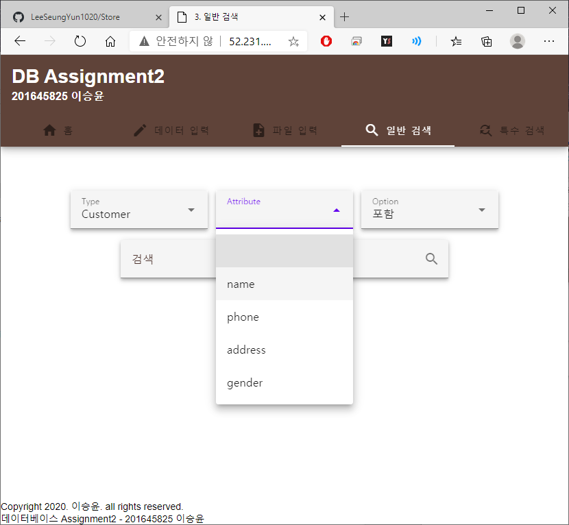

# Store (DB final assignment)

## 개요

데이테베이스 응용 프로그램 개발 [파일](./assignment.pdf)  
주어진 데이터베이스를 대상으로 아래의 기능을 지원하는 데이터베이스 기반 시스템 개발

1. 고객, 거래, 상품 데이터 개별 입력
2. 여러 개의 데이터 파일(CSV)로부터 입력
   1. 고객: C, name(key), phone, address, gender
   2. 거래: T, transactionNnumber(key), productID, price, date, customerName
   3. 상품: P, name, productID(key), supplierName
3. 데이터 속성 기반 검색
4. 특별한 검색 조건 지원
   1. 남자보다 여자가 많이 산 상품의 이름
   2. 주어진 날 이전에 가장 많은 거래(금액기준)가 이루어진 k 가지 상품
   3. 하나의 supplier에서 m 번 이상의 제품을 산 고객의 이름

## 작동 화면

### 1. 데이터 입력 (/input/manual)


### 2. 파일 입력 (/input/file)


### 3. 일반 검색 (/search/type)





### 4. 특수 검색 (/search/case)


## SQL

### 1. 입력

```mysql
INSERT INTO customer (name, phone, address, gender) VALUE (?, ?, ?, ?);
INSERT INTO trade (transactionNumber, productID, price, date, customerName) VALUE (?, ?, ?, ?, ?);
INSERT INTO product (productID, name, supplierName) VALUE (?, ?, ?);
```

### 2. 검색

```mysql
SELECT * from ${req.params.type} where ${req.params.attr} LIKE ?
```

#### case1

```mysql
select product.name
from (select trade.productID, count(trade.transactionnumber) as count
      from customer,
           trade
      where name = customerName
        and customer.gender = 'Female'
      group by trade.productID) female,
     (select productID, 0 as count
      from product
      where productID not in (select trade.productID
                              from customer, trade
                              where name = customerName and customer.gender = 'Male')
      UNION
      select trade.productID, count(trade.transactionnumber) as count
      from customer,
           trade
      where name = customerName
        and customer.gender = 'Male'
      group by trade.productID) male, product
where (female.productID = male.productID and female.count > male.count and female.productID = product.productID)
```

#### case2

```mysql
select product.*
from trade, product
where product.productID = trade.productID and date(date) < date(?)
group by product.productID
order by sum(price) desc
limit ${req.body.count}
```

#### case3

```mysql
select customer.name
from customer, trade, product
where customer.name = trade.customerName and trade.productID = product.productID
group by customerName
having count(transactionNumber) >= ?
```

## 서버

Microsoft Azure를 이용하여 Linux 가상 머신을 만들어 서버를 구성하였다.  


pm2를 사용하여 서버가 계속 작동하도록 하였다.  
